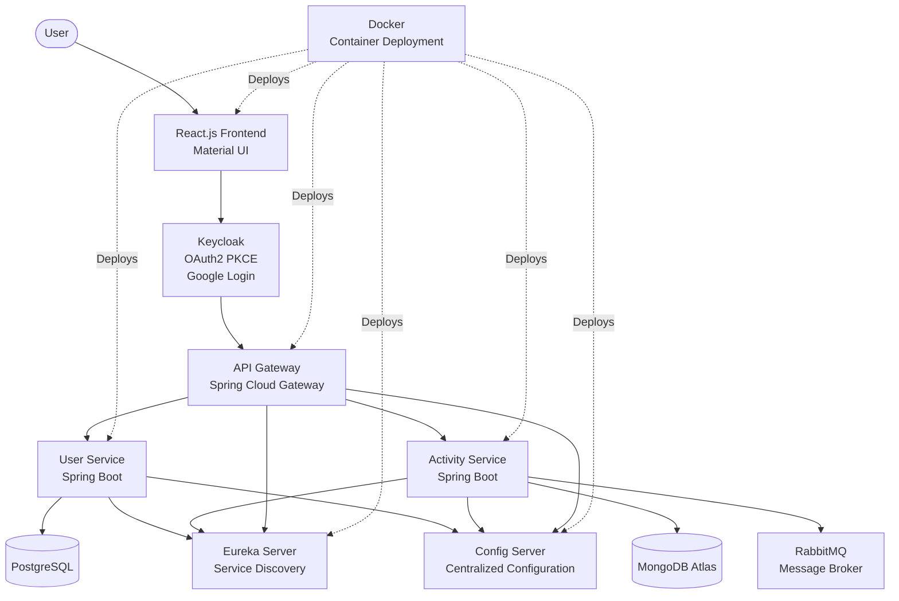

# 1. FitTrack - Fitness Tracker Microservice Web Application

A full-stack **Fitness Tracker Microservice Web Application** designed to help users log, manage, and track their fitness activities in a secure, scalable, and distributed environment.

The application follows a **microservices architecture** with secure authentication, API Gateway routing, service discovery, centralized configuration, and asynchronous communication between services.

---

## 2. Project Overview

FitTrack allows users to:

- 🏃‍♂️ Add and manage daily workout activities
- ⏱️ Track workout duration, calories burned, and fitness progress
- 🔐 Authenticate securely using Keycloak OAuth2 PKCE (with Google login support)
- ⚡ Enable communication between services using RabbitMQ
- 🐳 Run all microservices seamlessly using Docker

---

  ## 3. System Architecture


## 4. Tech Stack

### Backend
- Spring Boot
- Spring Cloud (Eureka Server, API Gateway)
- Hibernate
- Spring Data JPA

### Frontend
- React.js
- Material UI (MUI)

### Security
- Keycloak
- OAuth2
- PKCE Authentication Flow

### Messaging
- RabbitMQ

### Database
- PostgreSQL
- MongoDB Atlas

### Containerization
- Docker

## 🚀 How to Run the Project

### Prerequisites

Make sure you have installed:

- Java 17+
- Maven
- Node.js and npm
- Docker
- PostgreSQL
- MongoDB Atlas
- Keycloak

---

##  Backend Setup

1. Clone the repository:

```bash
git clone https://github.com/Nikita-Saxena391/FitTrack-microservices.git
```

2. Navigate to each microservice folder and run:

```bash
mvn spring-boot:run
```

3. Start the services in the following order:

```
1. Config Server
2. Eureka Server
3. API Gateway
4. User Service
5. Activity Service
```

---

##  Frontend Setup

1. Navigate to the frontend directory:

```bash
cd frontend
```

2. Install dependencies:

```bash
npm install
```

3. Start the React application:

```bash
npm start
```

---

## 🐳 Running with Docker

Build and start containers using:

```bash
docker-compose up --build
```

To stop the containers:

```bash
docker-compose down
```

---

## 🔐 Authentication Setup

1. Start Keycloak server.
2. Create a new realm.
3. Configure the client for OAuth2 PKCE authentication.
4. Enable Google login provider.
5. Update frontend configuration with Keycloak details.

---

##  Application Access

After starting all services:

- Frontend:
```
http://localhost:5173
```

- API Gateway:
```
http://localhost:8080
```

- Eureka Server:
```
http://localhost:8761
```
